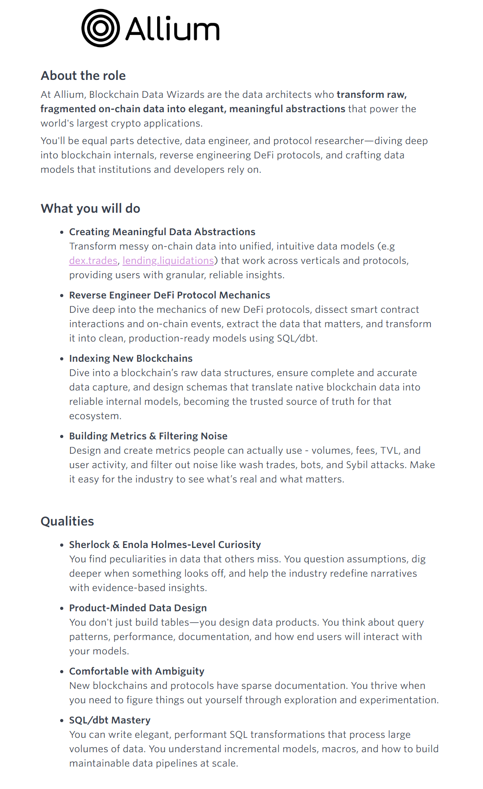

我看到了。[Allium的Blockchain Data Wizard, Analyst or Scientist](https://jobs.ashbyhq.com/allium/6ad02951-721e-48a6-8a95-95a9139393a9)Allium的Blockchain Data Wizard, Analyst or Scientist

我对这个岗位比较感兴趣。能够把散落在区块链上各个角落的数据，整理成各种有用的数据，是非常有成就感的事情。这就和我之前一直从事的数据采集工作非常的相似。以前我是从各个网站上采集数据然后清洗入库。现在是从区块链上解析出各个协议的数据。

我想做一个简单的但是结构健全的数据平台。我从区块链节点收集数据，然后根据协议abi解析关键事件。然后整理成可供审计可供数据分析师使用的规范数据。

我打算目前先做两条链Ethereum 和 Arc链。
